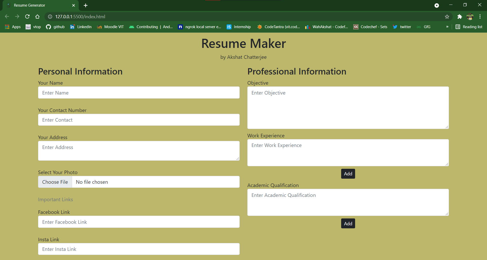
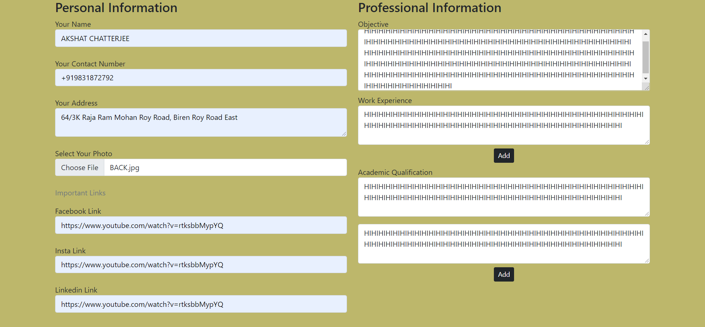
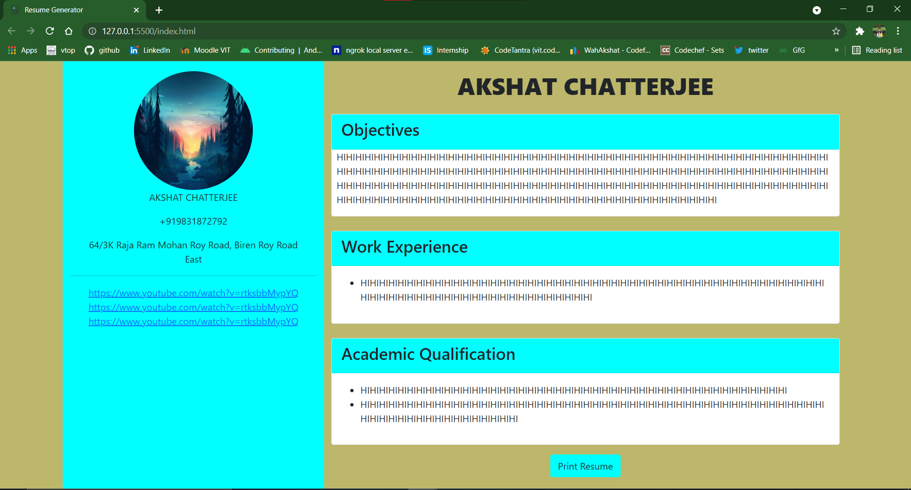
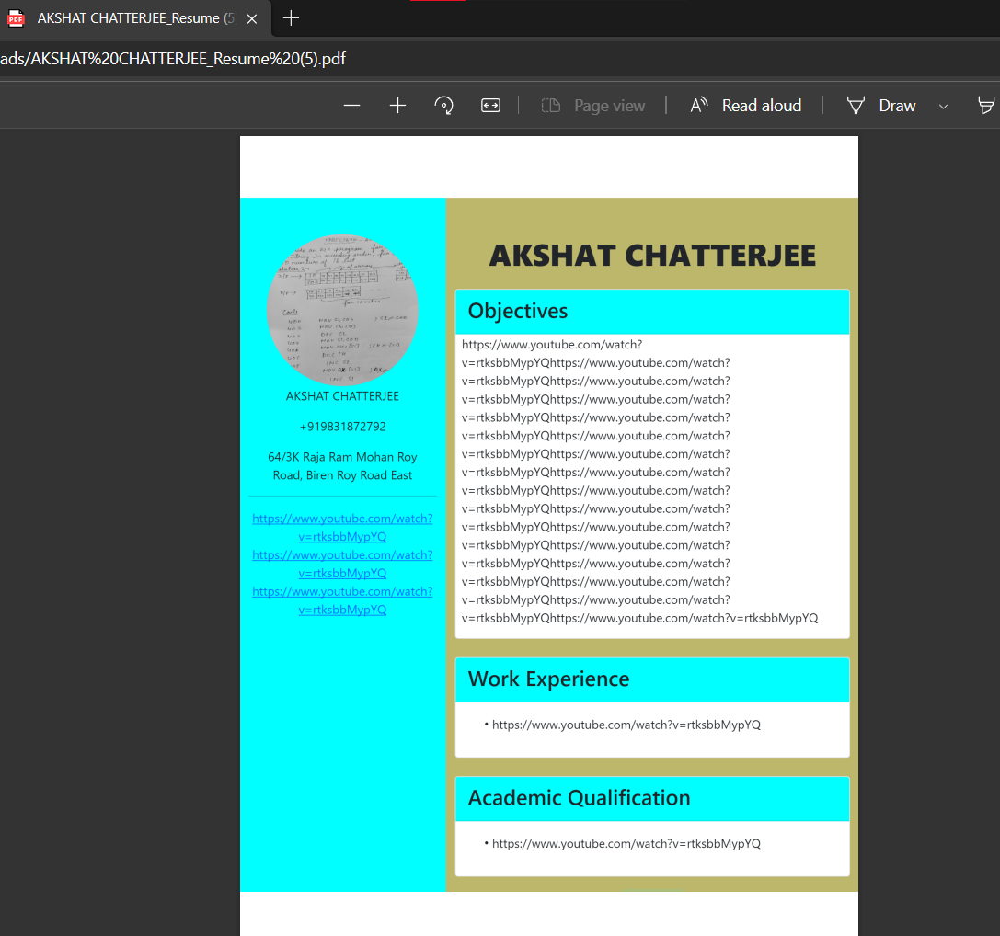

<h1># ResumeGenerator-JS</h1>

Made live https://akshat-resume-maker.netlify.app/ with Netlify!

Used Bootstrap - https://getbootstrap.com/docs/5.1/getting-started/introduction/  
Used DOM manipulation of js and form Validation  
Used HTML2PDF.js for printing HTML page to pdf form   

 
 
<h3>Can insert more input fields!</h3>
 
<h3>Resume Template Generated</h3>
 
<h3>Resume pdf downloaded (This is just an example with dummy data)</h3>
 
